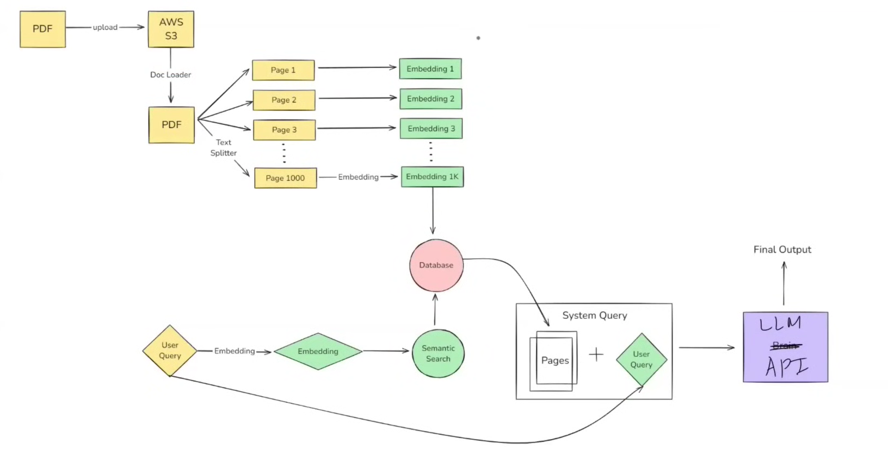

## Langchain Lession 01:
---------------------------------------------------------------------------------------

### What is LangChain
- Langchain is an open-soure framework for developing applications powered by large language models (LLMs).

### Why Langchain is required?
- Let's take an example if you are working to create a PDF Question Answering chatbot. If a user upload an e-book to the system, user should be able to ask some question. 
- A tradional system is to find keywords. But using the LLMs will require various components such as Embeddings, semantic search, Doc Loader, Database etc.

### Various Challenges: 

1. **LLM as Brain**

2. **Computation:** There are various public LLMs like Chatgpt, Gemini etc. These LLMs offer Public APIs and response differs.  

3. **Orchestration of Components**: All these components are moving parts. Since, in the LLM if currently you are using OpenAI later change to Gemini. Or change embedding model etc. And if all these components are coded from scratch and while switching or changing one part requires a lot of changes into the code. 

### Benefits of Langchain:

1. **Concepts of chaining:** Chain various tasks
2. **Model Agnostic development:** Use any type of LLM.
3. **Complete ecosystem**
4. **Memory and state handling**

### What you can build? 

1. Conversational Chatbot
2. AI knowledge Assistant
3. AI Agents
4. Workflow Automation
5. Summarization/Research helpers

### Alternatives

- LLamaIndex
- HayStack