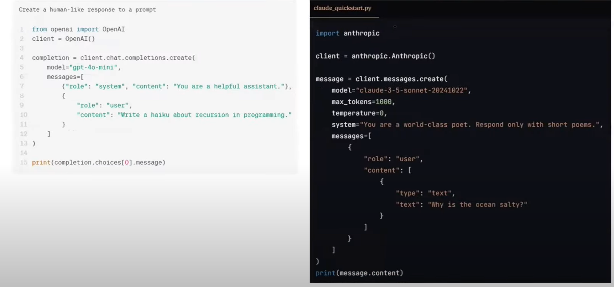
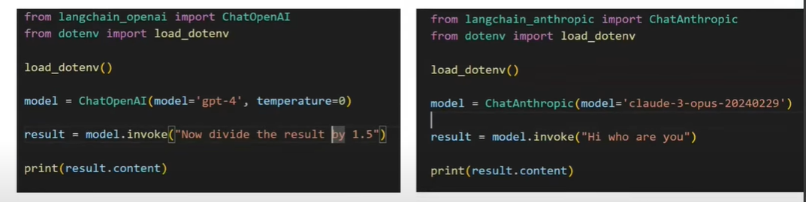
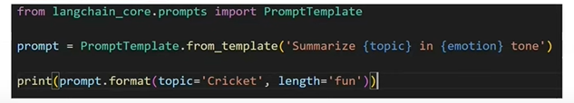
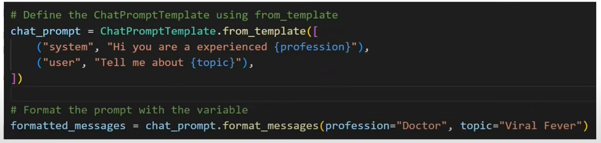
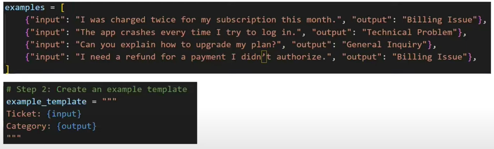
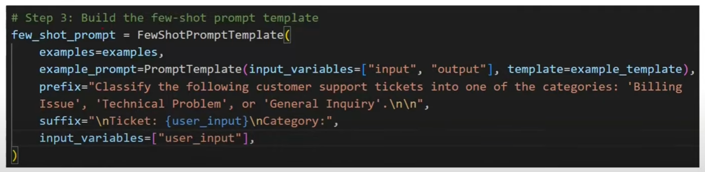
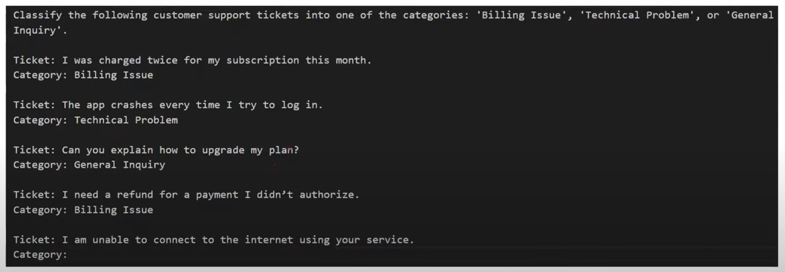
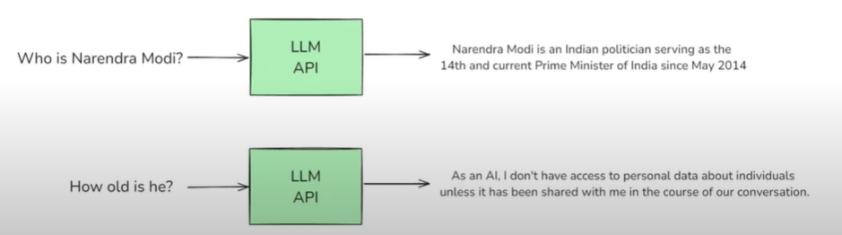

## Lession 02: LangChain Components

### 1. Models:

- *In Langchain, "models" are the core interfaces through which you interact with AI Models.*

- In earlier time everyone wanted to make a chatbot using NLP. And there are two major challenges:
    - **NLU:** Natural language understanding. Chatbot must be able to understand the user query. 
    - **Reply:**  Reply should be context aware. 

-  *LLMs solved both of these problems.*

- We are required to different code if want to use two different LLMs or if we need to change API from openAI to claude APIs. Like shown below:

- Langchain solves this problem: 

- In langchain there are two types of models:
    - **Language Model:** Like LLMs Text as input and outputs text.
    - **Embedding Model** For semantic search. Text as input and outputs vector.

- Langchain Available Model Intergrations: https://python.langchain.com/docs/integrations/chat/

### 2. Prompts 

- *Inputs provided to LLM are Prompts.*

- Various kind of Prompts:
    - **Dynamic & Reusable Prompts**
    
    - **Role base Prompts**
    
    - **Few shot Prompting**
    
    
    

### 3. Chains
- Any application you can create a shape of pipeline. for e.g., Building Translation & Summary application where input will be english sentence and output will get Hindi summary. 
- Pipeline: Input -> LLM -> Translation -> LLM -> Summary.
- Chains transfer one stage output to another stage input without any extra code. 
- *Parallel chain* pipeline also possible to create. 
- *Conditional chain* pipeline also possible. e.g., You are creating a customer app after taking input review take if review is good or bad. If good outputs Thank you. If bad sending an Email. 

### 4. Indexes
- *Indexes connect you application to external knowledge - such as PDFs, websites or databases.*

- Some of the Components are like DataLoader, Text Splitter, Vector Stores, Retrievers.
- Application like RAG application where external knowledge is required. E.g., Chatgpt doesn't knows about your office policy. Therefore, extra knowledge will be shared to the LLM to generate the response.

### 5. Memory

- *LLM API calls are stateless.*

- Types of Memory: 
    - **ConversationBufferMemory:** Stores a transcript of recent messages. Great for short chats but can grow large quickly.
    - **ConversationBufferWindowMemory:** Only keeps the last N interactions to avoid excessive token usage.
    - **Summarizer-Based Memory:** Periodically summarizes older chat segments to keep a condensed memory footprint. 
    - **Custom Memory:** For advanced use cases, you can store specialized state (e.g., the user's preferences or key facts about them) in a custom memory class.

### 6. AI Agents: 
- LLMs (NLU + Textgen) 
- Travel websites. You can search availability for flight and also ask to book flight or hotel etc.
- AI agent has reasoning capability and also tools. Tools like Calculator, weather API
- *Chain of thought Prompting* AI agent break prompt into multiple queries. 