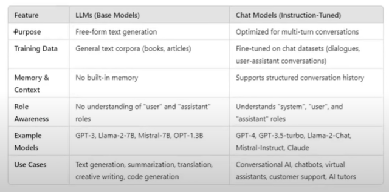
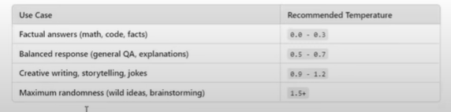
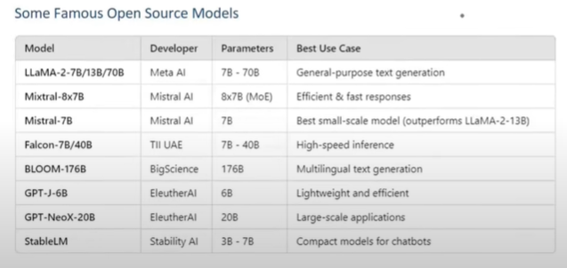
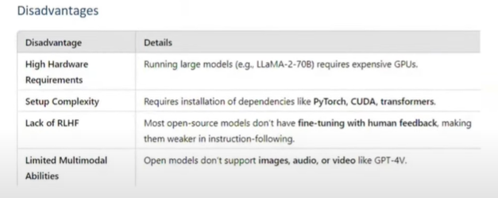

## Lession 03: Models

### What are Models

The Model component in Langchain is a crucial part of the framework, designed to facilitate interactions with various Language models and Embedding Models. 

It abstracts the complexity of working directly with different LLMs, chat models, and embedding models, providing a uniform interface to communicate with them. This makes it easier to build applications that rely on AI-generated text, text embeddings for similarity search and retrieval-augmented generation (RAG). 

(As discussed in lession 02.)

### Language Models
- Language Models are AI system designed to process, generate, and understand natural language text. 

- **LLM:** General purpose models that is used for raw text generation. They take a string(or plain text) as input and returns a string(plain text). These are traditionally older models and are not used much now. 

- **Chat Models:** Language Models that are specialized for conversational tasks. They take a sequence of messages as inputs and return chat message as outputs (as opposed to using plain text). These are traditionally newer models and used more in comparison to the LLMs. 

- **Temperature:** Temperature is a parameter that controls the randomness of a language model's output. It affects how creative or deterministic the responses are. 
    - **Lower values (0.0-0.3)** - More determnistic and predictable. 
    - **Higher values (0.7 - 1.5)** - More random, creative and diverse. 

### Open Source Models

Open-source language models are freely available AI Models that can be downloaded, modified, fine-tuned, and deployed without restrictions from a central provider. Unlike closed source models such as OepnAI's GPT-4, Anthropic's Claude, or Google Gemini, open-source models models allow full control and customization. 

- **Where to find them?:** Huggingface the largest repository of open-source LLMs. 

- **Ways to use Open-source Models**
    - Using Hugging Face Inference API
    - Running Locally

    