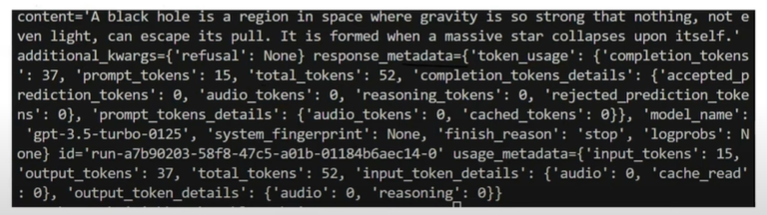

## Lession 06:
-------------------------------------

### Output Parser:
- Now, we have studied `with_structure_output` in lession 05. That can be used with model supporting structured output. But for various model opensource those doesn't support structured output. There we require to use `output_parser`.
- **Output Parser** in LangCain help convert raw LLM responses into structured formats like JSON, CSV, Pydantic Models and more. They ensure consistency, validation, and ease of use in applications. 
- This can be used with models supporting or not supporting structured response.
- There are various types of Output parsers:
    1. StrOutputParser
    2. JSON OutputParser
    3. Structured Output Parser
    4. Pydantic Output Parser

#### 1. StrOutputParser
- The StrOutputParser is the simplest output parser in LangChain. It is used to parse the output of a Language Model(LLM) and return it as a plain string.

- Whenever we talk to an LLM, when we get any result we use `result.content` to get string. And when we use `StrOutputParser` we don't need to use `result.content` it automatically captures.
-  Usecase: Topic -> LLM -> Output: Detailed Report -> LLM -> Summarize in 5 lines.

#### 2. JsonOutputParser
- It forces LLM to pass the output in JSON format. That is the main purpose of the application.
- *Disadvantages:* You cannot pass an schema with Json parser and expect result in same schema. Therefore it will be difficult to be used in application where you need a fixed schema.

#### 3. StructuredOutputParser
- StructuredOutputParser is an output parser in Langchain that helps extract structured JSON data from LLM responses based on pre-defined field schemas. 
- It works by defining a list of fields(ResponseSchema) that the model should return, ensuring the output follows a structured format. 
- In StructuredOutputParser we can get data in specified format but *we cannot do a validation of the data.* This is the disadvantage.
- For e.g, if we are asking for age in integer format but there is possibility we will get age in other format like `age:'20'` or `age: '20 years'`

#### 4. PydanticOutputParser

- PydanticOutputParser is a **structured output parser** in langchain that uses Pydantic Models to enforce schema validation when processing LLM responses. 
- **Advantages:**
    - ✅**Strict Schema Enforcement** -> Ensures that LLM responses follow a well-defined structure.
    - ✅**Type Safety** -> Automatically converts LLM outputs into Python Objects. 
    - ✅**Easy Validation** -> Uses Pydantic's built-in validation to catch incorrect or missing data.
    - ✅**Seamless Integration** -> Works well with other langchain components
