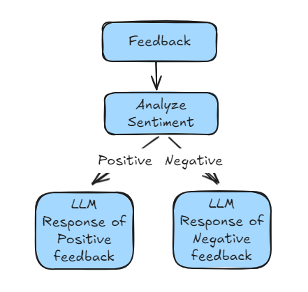

## Lession 07:

## Chains in LangChain
### What & Why?
- Chains in langchain helps to build a pipeline for the complex applications.
- Chain automatically takes output and pass a input to the next component in chain.
- Manual passing output to next component is saved and it creates simple understandable code. 
- Chains can be easily visualized as well.
- Using chain we can create various kinds of pipelines. 

### Types of Chain:
1. Linear/Sequential Chains
2. Parallel Chains
3. Conditional Chains

#### 1. Sequential Chains
- Let's create a simple chain: 
```
Topic -> LLM -> Generated report on topic -> LLM -> Generated Summary
```

#### 2. Parallel Chains
- Chains will be executed parallely. 
- E.g, if user wants to create Notes and Quiz both from some notes. 
```
Chain 1: Notes -> Model 1 -> Notes 
Chain 2: Notes -> Model 2 -> Quiz 
Chain 3: Notes & Quiz -> Model 3 -> Merged result
```


#### 3. Conditional Chain
