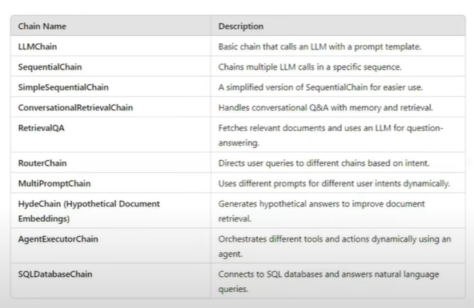

## Lession 08

## Runnables in LangChain

### The why?
- When first LLM was lauched by OpenAI, langchain user felt there should be some library to help develop AI application. Therefore, langchain comes into picture.
- In an LLM application there are various components, Loading PDF, splitting text, storing vector, retrievers, LLM model, parser etc.
- Langchain helps create these components, but in initial version these components are developed standalone and no connection or standard was being followed. 
- Therefore, problem was these components linking required lot of code and different functions like `predict`, `format` etc. And developers was getting lot of difficulty. 
- In order to solve this various Chains are created by Langchain community:

- But this create more problems:
    - Codebase is increased significantly. 
    - New AI Engineer getting confused. 
    - Integration of those components was not easy. 
    - Without re-writing these components it was not possible.

### The What?
- Runnable is a unit of work, we can pass `input`, it will `process` it and at end we get `output`.
- Common interface is there in Runnable `invoke()`, `batch()` and `stream()`.
- We can connect various components togerther to form runnables as well and two or more runnables as well.
- Check code to understand better `8.Runnables`

### Type of Runnables
- **Task Specific Runnables**
    - **Definition:** These are core LangChain Components that have been converted into Runnables so they can be used in Pipelines.
    - **Purpose:** Perform task-specific operations like LLM calls, prompting, retrieval etc. 
    - **Examples:**
        - `ChatOpenAI` -> Runs an LLM Model.
        - `PromptTemplate` -> Formats prompts dynamically.
        - `Retriever` -> Retreives relevant documents.

- **Runnable Primitives:**
    - **Definition:** These are fundamental building blocks for structuring execution login in AI workflows.
    - **Purpose:** They help orchestrate execution by defining how different Runnables interact.(Sequentially, in-parallel, conditionally etc.)
    - **Examples:**
        - `RunnableSequence` -> Runs steps in order (`|` operator)
        - `RunnableParallel` -> Runs multiple steps simultaneously.
        - `RunnableMap` -> Maps the same input across multiple functions.
        - `RunnableBranch` -> Implements conditional execution (if else logic)
        - `RunnableLambda` -> Wraps custom Python functions into Runnables.
        - `RunnablePassThrough` -> Just forwards input as output (acts as a placeholder)
        