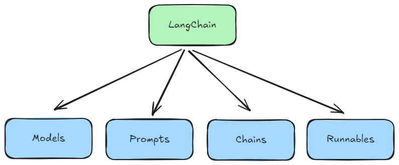

# Lession 09: Document Loaders in Langchain

----------------------------------------------

## RAG:
RAG is technique that combines information retrieval with language generation, where a model retrieves relevant documents from a knowledge base and then uses them as context to generate accurate and grounded response. 

Benefits of using RAG: 
1. Use of up to date information
2. Better privacy
3. No limit of document size



## Document Loaders


Document Loaders are components in langchain used to load data from various sources into a standardized format (usually as document object), which can then be used for chunking, embedding, retreival and generation. 

*Standard format:*
```
Document{
    page_content = "The actual text content",
    metadata = {"source": "filename.pdf" ...}
}
```

### 1. Text Loader:

Text loader is a simple 