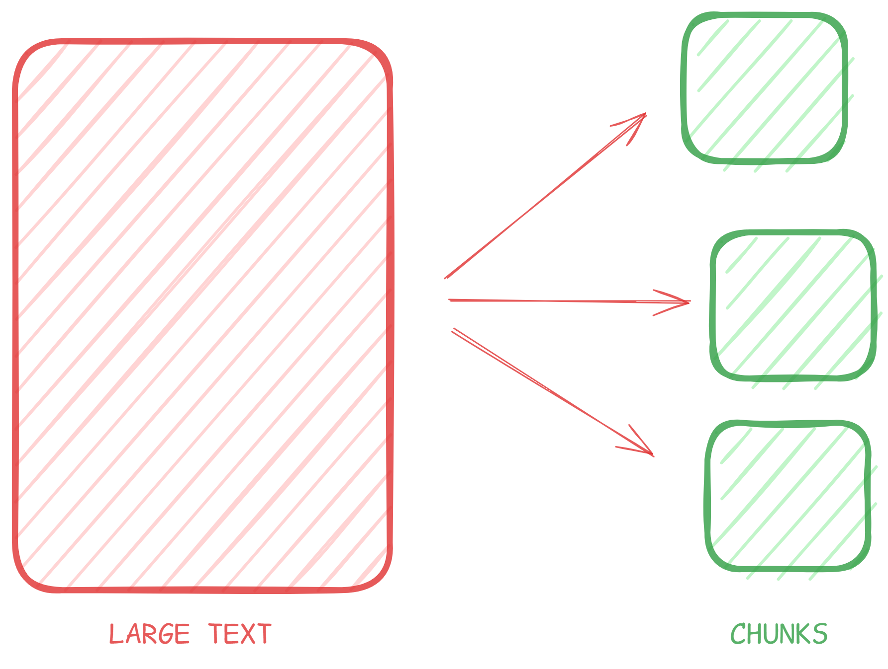
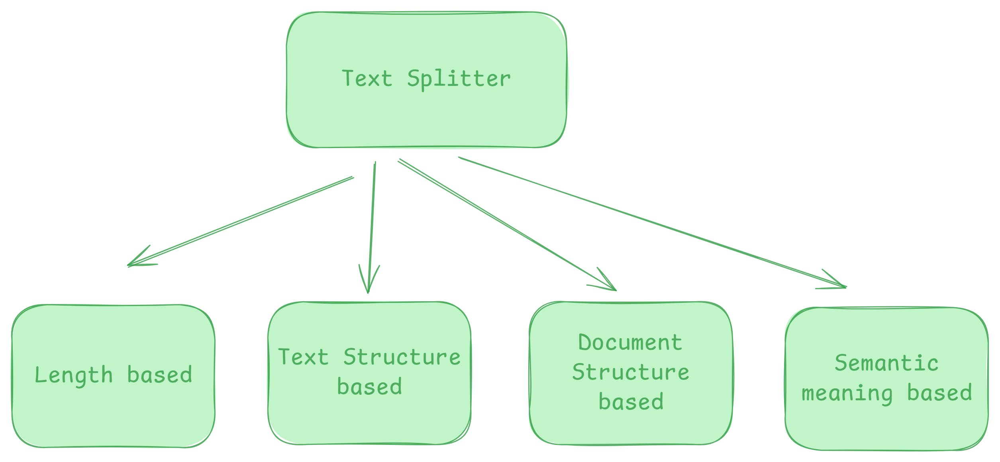
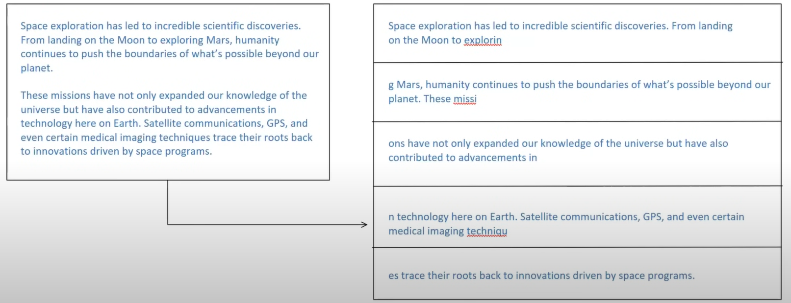
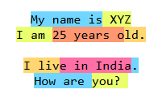
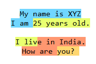

# Text Splitters in Langchain

## Text Splitting

Text splitting is the process of breaking large chunks of text(like Article, PDFs, HTML pages or books) into smaller, managable pieces(chunks) that can LLM can handle effectively. 



- **Overcoming Model defination:** Many embeddings models and language models have maximum input size constraints, splitting allows us to process documents that would otherwise exceed these limits.
- **Downstream tasks:**  Text splitting improves nearly every LLM powered tasks. 

| **Tasks**       | **Why splitting help**                       |
|-----------------|----------------------------------------------|
| Embedding       | Short chunks yields more accurate vectors.   |
| Semantic search | Search result point to focus info, not noise |
| Summarization   | Prevents hallucination and topic drift       |

- **Optimizing computation resources:** Working with smaller chunks of text can be more memory-efficient and allow for better parallelization of processing tasks.



### 1. Length based Text Splitting:



Website: [Text Chunking Website](https://chunkviz.up.rail   way.app/[/url)

### 2. Text Structured based: 

```
My name is XYZ
I am 25 years old.

I live in India.
How are you? 
```

Splitters: ```\n\n (para), \n(line), word, character```

Chunk Size: 10



Chunk Size: 20



### 3. Document Structure based:

Like Mardown, Code Document etc.

```
class Student: 
def __init__(self, name, age, grade):
    self.name = name
    self.age = age 
    self.grade = grade 

def get_details(self):
    return f"Name: {self.name}, Age: {self.age}, Grade: {self.grade}"

def is_passing(self):
    return self.grade >=6.0 

#example usage 
student1 = Student("Arnav", 20, 8.2)
print(student1.get_details())

if student1.is_passing(): 
    print("Student is passing.)
else: 
    print("Student is failing.")

```
Splitting: 
```
# First try to split along class definitions
"\nclass"
"\ndef"
"\n\tdef " 
# Now split by the normal types of lines
"\n\n"
"\n"
" "
""
```

### 4. Semnantic Meaning based 

Two paragraph with different semantic meaning or different topics.
```
Farmers were working hard in the fields, preparing the soil and planting seeds for the next season. The sun was bright, and air smelled of earth and fresh grass. The Indian Premier League(IPL) is the biggest cricket league in the world. People all over the world enjoy matches and cheer for their favourite team.

Terrorism is a big danger to peace and safety. It causes hard to people and create fear in cities and villages.  When such attack happens, they leave behind pain and sadness. To fight terrorism we need strong laws, alert security forces, and support from people who cares about peace and safety. 

```
**Working:** Each sentence embedding is compared to find cosine similarity. If two sentences are similar they are formed in a group otherwise they will be splitted. 

**Drawback:** This technique is not very accurate at the time.