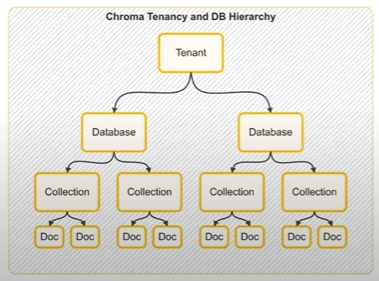

# Vector Stores

## What are Vector Stores
A vector store is a system designed to store and retreive all data represented as numerical vectors. 

**Key Features:**
- **Storage:** Ensures that vectors and their associated metadata are retained, whether in memory for quick lookups or on-disk for durability and large scale use. 

- **Similarity Search:** Helps retrieve the vectors most similar to a query vector. 

- **Indexing:** Provides a data structure or method that enables fast similarity searches on high dimensional vectors(e.g., approximate nearest neighbour lookups)

- **CRUD Operation:** Manage the lifecycle of data - Adding new vectors, reading them, updating existing enteries, removing outdated vectors. 

**USECASES**: 

- Semantic Search
- RAG 
- Recommender System
- Image/Multimedia search

## Vector Store Vs Vector Database 

### **Vector Stores**
- Typically refers to a light weighted library or service that focuses on storing vectors (embeddings) and performing similarity search.

- May not include many traditional database features like transactions, rich query, languages or role based access control. 

- Ideal for prototyping smaller scale applications. 
- Example: FAISS (where you store vectors and can query them by similarity, but you handle persistance and scalling seperately.)

### **Vector Database**

- A full fledged database system designed to store and query vectors. 
- Offers additional database like features: 
    - Distributed architectures for horizontal scaling 
    - Durability and persistence (Replication, backup/restore)
    - Metadata handling (schemas, filters) 
    - Potential for ACID or near ACID gurantees. 
    - Authentical/Authorization and more advanced security. 
- Geared for production environments with significant scaling large datasets. 
- Example: Milvus, Qdrant, Weaviate, Pinecone

*A vector database is effectively a vector store with extra database features (e.g., clustering, scaling, security, metadata filtering and durability.)*

### **Vector stores in Langchain**

- **Supported stores:** Langchain integrates with multiple vector stores (FAISS, Pinecone, Chroma, Qdrant, Weaviate etc.) giving you flexibility in scale, features and deployment. 

- **Common Interface:** A uniform vector store API lets you swap out one backbone (e.g, FAISS) for another (e.g, Pinecone) with minimal code changes. 

- **Metadata Handling:** Most vector stores in langchain allow you to attach metadata (e.g, timestamps, authors etc.) to each document, enabling filters based retrieval. 

**Functions**
- ```from_documents(...) or from_texts(...)```
- ```add_documents(...) or add_texts(...)```
- ```similarity_search(query, k=...)```

### Chroma Vector Store

Chroma is a lightweight, opensource vector database that is especially friendly for local development and small to medium- scale production needs.



*Its between vector store and vector database.*