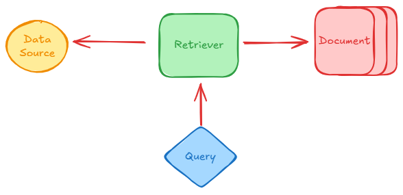

# Retreivers in LangChain

## What are Retrievers

- A retriever is a component in langchain that fetches relevant document from a data source in response to a user query. 

- There are multiple type of retrievers. 

- *All retrievers in Langchain are Runnables.*



## Type of Retrievers

### Based on Data source: 

- **Wikipedia Retrievers**
- **Vector Store Retrievers**
- **Arxiv Retreivers**

*Read More: https://python.langchain.com/v0.1/docs/modules/data_connection/retrievers/*

### Based on Search Strategy

- **MMR: Maximal Marginal Retreivar**
- **Multi Query Retreiver**
- **Contexual Compression Retreiver**

### Wikipedia Retrievers: 

- A wikipedia retriever is a retriever that queries the Wikipedia API to fetch relevant content for a given query. 

#### ⚙️How it works:

1. You gave it a query (e.g., Alberts Einstein)

2. It sends the query to Wikipedia's API.

3. It retreives the most *relevant article.*(some keyword matching in background) 

4. It returns them as LangChain `Document` object.

### Vector Stores Retrievers

A vector store retriever in Langchain is the most common type of retriever that lets you search and fetch documents from a vector store based on semantic similarity using vector embedding.

#### ⚙️How it works:

1. You store your documents in a vector store like FAISS, Chroma, Weaviate.
2. Each document is coverted into a dense vector using an embedding model. 
3. When the user enters a query:
    - Its also turned into vector 
    - The retriever compares the query vector with the stored vector.
    - It retrieves the top k-most similar ones.

#### Kinds of Vectorstore Retreievers: 
##### 1. Maximum Marginal Retrievers(MMR): 

*How can we pick results that are not only relevant to the query but also different from each other?*

**🤔Why MMR Retriever?**
In regular similarity search, you may get documents that are: 
- All very similar to each other.
- Repeating the same info
- Lacking diverse perspectives

MMR Retriever avoids that by: 
- Picking the **most relevant document** first
- Then picking the next most relevant and least similar to already selected docs.
- And so on... 

This helps especially in RAG pipelines where: 
- You want your context window to contain **diverse but still relevant information.** 
- espically useful when documents are semantically overlapping.

##### 2. Multi-Query Retriever: 

Sometimes a single query might not capture all the ways information is phrased in your documents. 

For example:
**Query:**
`"How can I stay healthy?"`
LLM generated multiple query:
```
1. "What are the best foods to maintain good health?"
2. "How often should I exercise to stay fit?"
3. "What lifestyle habits improve mental and physical wellness?"
4. "How can I boost my immune system naturally?"
5. "What daily routines support long-term health?" 

```
Could mean: 
- What should I eat? 
- How often should I exercise? 
- How can I manage stress? 

A simple similarity search might **miss documents** that talk about those things but don't use the word "healthy". 

1. Take your original query.
2. Use can LLM (e.g., GPT-3.5) to generate multiple semantically different version of that query.
3. Performs retrieval for each sub-query.
4. Combines and duplicates the results.

##### 3. Contexual Compression Retriever

The Contextual Compression Retriever in LangChain is an advanced retiever that improves retrieval quality by compressing documents after retrieval - keeping only the relevant content based on the user's query. 

❓**Query:**

`What is Photosynthesis?`

**📄Retrieved Document(by a traditional retriever): 
```
"The grand canyan is a famous natura site.
Photosynthesis is how plants convert light into energy.
Many Tourist visit every year."
```

❌Problem:
-  The retriever returns the **entire paragraph**
- Only **once sentence** is actually relvant to the query. 
- The rest is **irrelevant noise** that wastes context window and may confuse the LLM. 

✅**What Contextual Compression Retriever does:**
Returns only the relevant part. E.g.,
`Photosynthesis is how palnts convert light into energy.`

⚙️**How it works**
1. **Base Retrievers** (e.g., FAISS, Chroma) retrieves N documents. 
2. A **compressor** (usually an LLM) is applied to each document. 
3. The compressor keeps only the **parts relevant to the query.**
4. Irrelevant content is discarded. 

✅**When to use:**
- You documents are **long and contain mixed information.**
- You want to **reduce context length** for LLMs
- You need to **improve answer accuracy** in RAG pipelines.

## More Retrievers:

- BM25Retriever
- ParentDocumentRetriever
- SelfQueryRetriever
- MultiVectorRetriever
- TimeWeightedRetriever
- EnsembleRetriever
- ArxivRetriever

REF: https://python.langchain.com/docs/integrations/retrievers/