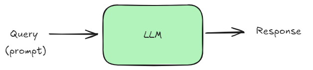
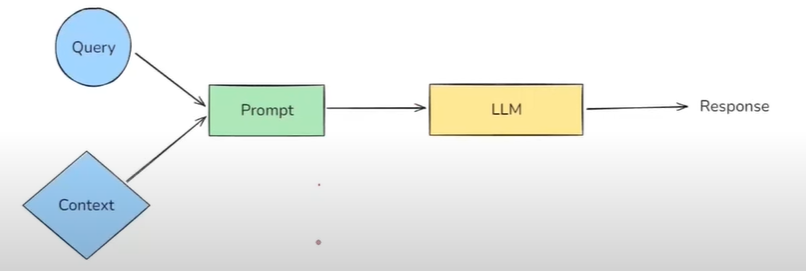
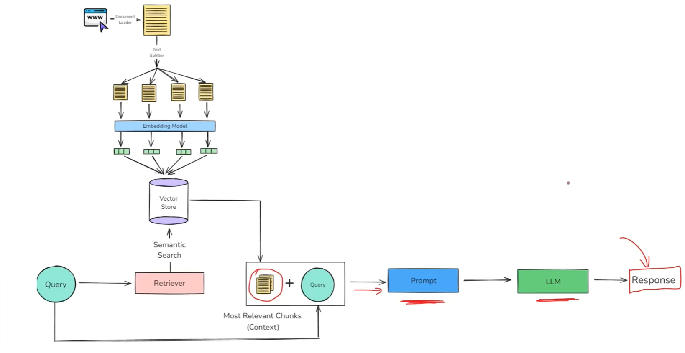

# What is RAG? 



- LLM stores the knowledge in parameters form (weights and biases).
- Larger the model more knowledge it will have. 
- Like model with 17 billion parameter model more powerfull than 13 billion. 

There are some scenarios which LLM cannot response:
1. Private Data:
    - E.g., If we are watching a youtube video and we ask about the topic discussed in video there is a possibility LLM may not be able to answer about that video. Since, at pre-training stage LLM didn't saw that video/data. 
    - E.g., If you ask about your company policy. 
2. Recent Data or Live data: 
    - If we ask about current news.
3. Hallucination: 
    - Sometimes LLM give False information with high confident. 
    - E.g., If we ask about Einstein, Model can confidently say Einstein in early days playing football for Germany. 
    - Since, LLM are probablistic there is possibility they may give imaginary answer if not able to get correct answer.

`One solution is there to solve these problem is Fine-Tuning.`

## Fine-tuning:
- In fine-tuning you take a pre-trained model and again trained on domain specific dataset.  
    - E.g., If you are developing for medical domain then you can pass medical data. Then it can answer on Medical domain as well. 
    - Types: 
        - Supervised Tuning labelled
        - Continued pretraining (Unsupervised method)
        - RLHF(Reinforcement learning from human feedback)
- Steps for fine-tuning:
    1. **Collect data**  
   A few hundred – few hundred-thousand carefully curated examples (prompts → desired outputs).

    2. **Choose a method**  
    Full-parameter FT, LoRA/QLoRA, or parameter-efficient adapters.

    3. **Train for a few epochs**  
    You keep the base weights frozen or partially frozen and update only a small subset (LoRA) or all weights (full FT).

    4. **Evaluate & safety-test**  
    Measure exact-match, factuality, and hallucination rate against held-out data; red-team for safety.
- Problems with Fine-tuning: 
    - Training such a large model is computanally expensive.
    - Strong Technical knowledge required. 
    - With new data incoming every time I need to train model. 
Therefore fine-tuning not good technique for this scenario.

## 2. In-Context Learning:
- In-context learning is a core capability of LLM like GPT-3/4, calude, and Llama, where the model learning to solve a task purely by seeing examples in the prompt without updating its weights. 
- Paper: https://arxiv.org/pdf/2005.14165
```
Below are examples of texts labeled with their sentiment.  
Use these examples to determine the sentiment of the final text.

Text: I love this phone. It’s so smooth. → Positive  
Text: This app crashes a lot. → Negative  
Text: The camera is amazing! → Positive  

Text: I hate the battery life. → 
```
Another example
```
Solve the math problems step by step:

Q: John has 3 apples. He buys 4 more. How many apples does he have now?  
A: John had 3 apples. He bought 4 more. 3 + 4 = 7. → 7  

Q: Sarah has 10 pens. She gives away 3. How many does she have left?  
A: Sarah had 10 pens. She gave away 3. 10 - 3 = 7. → 7  

Q: A pizza is cut into 8 slices. Alex eats 3 slices. How many are left?  
A:
```
*In-context learning is an LLM Emergant Property.*
An **Emergant property** is a behaviour or ability that suddenly appears in a system when it reaches a certain scale or complexity - even though it was not explicitly programmed or expected from the individual components. 

`See how you can use in-context learning to improve the problem.`
- Instead of just exmples tasks, retrieve **background information, facts, documents, product manuals etc.**
- Inject that into the prompt to augment the model's knowledge. 
- e.g., There is video tutorial and various topics are there. So, instead of sending whole video only send the transribe of part of video which is related to our query. 
E.g.,
```
"""You are a helpful assistant.  
Answer the question ONLY from the provided context.  
If the context is insufficient, just say you don't know.

{context}  
Question: {question}"""
```
RAG is a way to make a language model (like ChatGPT) smarter by giving it extra information at the time you ask your question.



## Understanding RAG
- RAG works on two principal if Information Retrieval and Text Generation. 
- In four steps you form a RAG system: 
    - Indexing
    - Retrieval
    - Augmentation
    - Generation 

### Indexing:
- Indexing is the process of preparing your knowledge base so that it can be efficiently searched at query time. This steps consists of 4 sub-steps. 

#### 1. Document ingestion
- You load you source knowledge into memory. 
- Examples: 
    - PDF reports, word documents
    - Youtube transcripts, blog pages
    - Github repos, internal wikis
    - SQL records, scaped webpages
- Tools:
    - Langchain loaders (`PyPDFLoader`,`YoutubeLoader`,`WebBaseLoader`, `GitLoader` etc.)

#### 2. Text chunking: 
- Break large documents into small, semantically meaningful chunks.
    - Why Chunks?
        - LLMs have context limits (e.g., 4K-32 Tokens)
        - Smaller chunks are more focused -> better semantic search
    - Tools
        - `RecursiveCharaterTextSplitter`, `MarkdownHeaderTextSplitter`, `SemanticChunker`

#### 3. Embedding Generation:
- Convert each chunk into a dense vector(embedding) that captures its meaning. 
    - Why embeddings? 
        - Similar ideas land close together in vector space
        - Allows fast, fuzzy semantic search
    - Tools:
        - `OpenAIEmbeddings`, `SentenceTransformerEmbeddings`, `InstructorEmbeddings`, etc.

#### 4. Storage in a Vector store:
- Store the vectors along with the original chunk text + metadata in a vector database. 
    - VectorDB Options:
        - Local: `FAISS`, `Chroma`
        - Cloud: `Pinecone`, `Weaviate`, `Milvus`, `Qdrant`

#### 5. Retrieval: 
- Retrieval is the real-time process of finding the most relevant pieces of information from a pre-built index (created during indexing) based on the user's question.

Its like asking: 
``` 
"From all the knowledge I have, which 3-5 chunks are most helpful to answer this query?"
```
#### 6. Augmentation
- Augmentation refers to the step where the retrieved documents(chunks of relevant context) are combined with the user's query to form a new, enriched prompt for the LLM.
```
"""You are a helpful assistant.
Answer the question ONLY from the provided context. If the context is insufficient, just say you don't know.

{context}
Question: {question}"""
```

#### 7. Generation:
- Generation is the final step where a LLM uses the user's query and the retrieved & augmented context to generate a response. 

