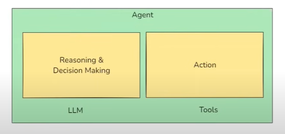

## Tools in Langchain

### What is a Tool? 
- A tool is just a Python function(or API) that is packaged in a way the LLM can understand and call when needed. 

LLMs like GPT are great at: 
- Reasoning
- Language generation

But they can't do things like:
- Access live data(weather, news)
- Do reliable math
- Call APIs
- Run Code
- Interact with a database

### Type of tools in Langchain:
- **Built-in Tools**
- **Custom Tools**

### How tools fits into the Agent ecosystem
- An AI agent is an LLM-powered system that can autonomously think, decide, and take actions using external tools or APIs to achieve a goal. 



#### 1. Built-in tools
- A built-in tool is a tool that LangChain already provides for you- it's pre-built, production-ready and requires minimal or no-setup. 

You don't have to write the function logic yourself - you just import and use it. 

| Tool Name               | Description                           |
|-------------------------|---------------------------------------|
| DuckDuckGoSearchRun     | Web search via DuckDuckGo             |
| WikipediaQueryRun       | Wikipedia summary                     |
| PythonREPLTool          | Run raw Python code                   |
| ShellTool               | Run shell commands                    |
| RequestsGetTool         | Make HTTP GET requests                |
| GmailSendMessageTool    | Send emails via Gmail                 |
| SlackSendMessageTool    | Post message to Slack                 |
| SQLDatabaseQueryTool    | Run SQL queries                       |

REF: https://python.langchain.com/docs/integrations/tools/

#### 2. Custom Tools
- A custom tools is a tool that you define yourself. 

Use them when: 
- You want to call your own APIs.
- You want to encapsulate business logic. 
- You want the LLM to interact with your database, product or app.

** Ways to create Custom Tools**
- Using `@tool` decorator
```
@tool
def multiply(a: int, b: int) -> int:
    """ Multiply two values"""
    return a*b
```

- Using StructuredTool & Pydantic
    - A structured tool in langchain is a special type of tool where the input to the tool follows a structured schema, typically defined using a Pydantic Model.
```
from langchain.tools import StructuredTool
from pydantic import BaseModel, Field

class MultiplyInput(BaseModel):
    a: int = Field(required = True, description = "The first number to multiply")
    b: int = Field(required = True, description = "The second number to multiply")

def multiply_func(a:int, b: int) -> int:
    return a*b

multiply_tool = StructuredTool.from_function(
    func = multiply_func,
    name = "multiply",
    description = "Multiply two numbers",
    args_schema = MultiplyInput
)

result = multiply_tool.invoke({'a':3, 'b':3})

```
- Using BaseTool class
    - BaseTool is the abstract base class for all tools in LangChain. It defines the core structure and interface that any tool must follow, whether it's a simple one-liner or a fully customized function. 
    - All other tools ttpes like `@tool`, `StructuredTool` are built on top of BaseTool.
```
from langchain.tools import BaseTool
from typing import Type

# Arg schema using Pydantic
class MultiplyInput(BaseModel):
    a: int = Field(required = True, description = "The first number to multiply")
    b: int = Field(required = True, description = "The second number to multiply")

class MultiplyTool(BaseTool):
    name: str = "multiply"
    description: str = "Multiply two numbers"

    args_schema: Type[BaseModel] = MultiplyInput

    # Async version can also be created as well here.
    def _run(self, a:int, b: int) -> int:
        return a*b

multiply_tool = MultiplyTool()
result = multiply_tool.invoke({'a': 3, 'b':3})


## Toolkits

A toolkit is just a collection (bundle) of related tools that serve a common purpose - packaged together for Convenience and reusability. 

In Langchain: 
- A toolkit might be: GoogleDriveToolkit
- And it can contain the following tools
    - `GoogleDriveCreateFileTool`: Upload a file 
    - `GoogleDriveSearchTool`: Search for a file by name/content
    - `GoogleDriveReadFileTool`: Read contents of a file


```
#Custom Tools
@tool
def add(a: int, b:int) -> int:
    """Add two numbers"""
    return a + b

@tool 
def multiply(a: int, b: int) -> int:
    """Multiply two numbers"""
    return a * b

class MathToolkit:
    def get_tools(self):
        return [add, multiply]

toolkit = MathToolkit()
tools = toolkit.get_tools()

for tool in tools: 
    print(tool.name, "->", tool.description)

```