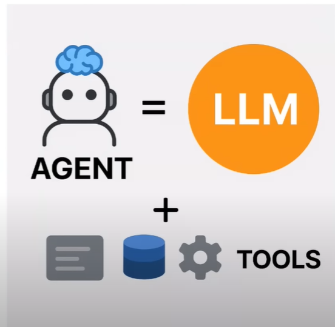
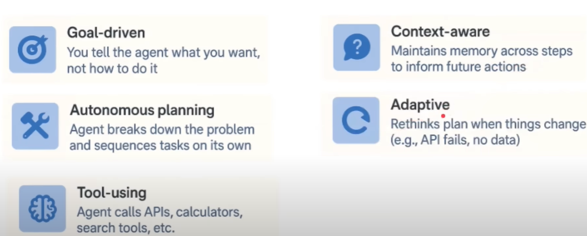
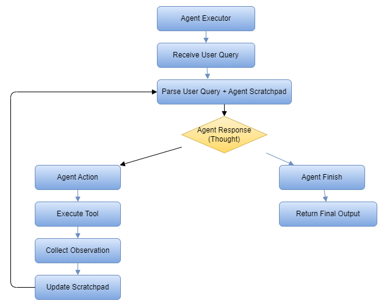

## AI Agent in LangChain


An **AI agent** is an intelligent system that:

- Receives a high-level goal from a user
- Autonomously plans, decides, and executes a sequence of actions  
- Uses external tools, APIs, or knowledge sources  
- Maintains context and reasons over multiple steps  
- Adapts to new information  
- Optimizes for the intended outcome






### 1.ReAct
- ReAct is a design pattern used in AI Agents that stands for Reasoning + Acting. It allows a language model (LLM) to interleave internal seasoning (thought) with external factors(like tool use) in a structured, multi-step process.

Instead of generating an answer in one go, the model thinks step by step, deciding what it needs to do next and optionally calling tools(APIs, Calculators, Web Search etc) to help it.

```
**Prompt:** What is the population of capital of france?
**Thought:** I need to find the capital of France.  
**Action:** search_tool  
**Action Input:** "capital of France"  
**Observation:** Paris  

**Thought:** Now I need the population of Paris.  
**Action:** search_tool  
**Action Input:** "population of Paris"  
**Observation:** 2.1 million  

**Thought:** I now know the final answer.  
**Final Answer:** Paris is the capital of France and has a population of ~2.1 million.
```

ReAct is useful for:

- Multi-step problems
- Tool-augmented tasks (web search, database lookup, etc.)
- Making the agent’s reasoning **transparent and auditable**

It was first introduced in the paper:  
*“[ReAct: Synergizing Reasoning and Acting in Language Models](https://arxiv.org/pdf/2210.03629)”* (Yao et al., 2022)


### 2. ReAct Working: Agent & Agent Executor

**AgentExecutor** orchestrates the **entire loop**:

1. Sends inputs and previous messages to the agent  
2. Gets the next `action` from agent  
3. Executes that tool with provided input  
4. Adds the tool's `observation` back into the history  
5. Loops again with updated history until the agent says `Final Answer`

#### 3. Creating an Agent

```
agent = create_react_agent(
    llm = llm,
    tools = [search_tool],
    prompt = prompt
)

```

