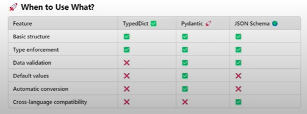

## Lession 05: Structured Output in Langchain

### Structured Output
- In langchain, structured output refers to the practice of having language models return responses in a well-defined data format(for example, JSON), rather than free form text. This makes the model output easier to parse and work with programmatically. 

```
[PROMPT] - Can you create a one-day travel itinerary for Paris? 

[LLM's Unstructured Response]
Here's a suggested itineary: Morning: visit the Eiffel Tower.

Afternoon: Walk through the Louvre Museum.

Evening: Enjoy dinner at a Seine riverside cafe.
[JSON enforced output]

[
    {"time": "Morning", "activity": "Visit the Eiffel Tower"},
    {"time": "Afternoon", "activity": "Walk through the Louvre Museum"},
    {"time": "Evening", "activity": "Enjoy dinner at a Seine riverside cafe"}
]
```
- Structure Output is useful in some of the scenarios like: 
    - Data Extraction: If we want to extract data from a pdf say and store it into DB. For e.g, If you are making a job portal and people are uploading resume. You want to extract some information from the resume and save it to job portal like, name, Marks, Experience etc. 
    - API Building: E.g., If working in Amazon. Generally people writes a long review of their products. So, you can take reviews and extract some data like topic, pros, cons, sentiment etc. Then these information you can share as APIs.
    - Agents: Agents required tools to do action like Calculator, weather etc. These Agents tools requires structured output to do actions.

- There are LLMs of two types:
    1. One who can generate structured output using `with_structured_output`
    2. One who can't generate structured output and those require langchain `output_parser`

#### 1. Using `with_structured_output`:
- We just need to specify data format to get structured output. We can give data format in three ways: 
    1. Typed Dict
    2. Pydantic
    3. Json_Schema

    - `1. TypedDict`: It is a way to define a dictionary in Python where you specify what keys and values should exist. It helps ensures that your dictionary follows a specific structure.
    - **Why use TypedDict?**
        - It tells python what keys are required and what type of values they should have. 
        - It doesn't validate data at runtime (it just helps with type hints for better coding).
        ```
        from typing import TypeDict
        
        class Person(TypedDict):
            name: str
            age:int
        
        new_person = Person = {'name': 'Atri', 'age': 30}

        print(new_person)
        ```
        - When you call model with `model.with_structured_output(Review)` and pass `Review` schema then behind the scene prompt is generated that may look something like this. e.g.,
        ```
        #schema
        class Review(TypeDict)  
            summary: str 
            sentiment: str 
        
        #Prompt Generated:
        You are an AI assistant that extracts structured insights from text. Given a product review, extract - Summary: A brief overview of the main points. - Sentiment: Overall tone of the review [positive, neutral, negative]. Return the response in JSON format. 
        ```
        - *Annotated TypeDict:* In Annotated typedict you pass detail as well. 
        ```
        # schema
        class Review(TypeDict):
            summary: Annotated[str, "A brief summary of the review"] 
            sentiment: Annotated[str, "Return sentiment of the review either negative, positive or neutral."]

        ```
        - *Disadvantages:* This method works fine but there is not a gurantee that if you ask output to be `string` then you will get string. Or you say if `rating` greater than 3 then only give result. That validation is not possible using typedict. Validation can be done using `Pydantic`.
    - `2. Pydantic`
        - Pydantic is a data validation and data parsing library for python. It ensures that the data you work with is correct, strctured, and type-safe.
        ```
        # To make sure student name must be string

        from pydantic import BaseModel

        class Student(BaseModel):
            name: str 

        new_student = {'name': 'Atri'}
        # new_student = {'name': 123} # will result in error

        student = Student(**new_student)

        print(type(student))
        ```
        - We can set default values as well. `name: str = 'Atri'`
        - We can add a `description`as well. 
        - We can add constraint greater than/less than using `Field()`
        ```
        class Student(BaseModel):
            name: str = 'nitish'
            age: Optional[int] = None
            email: EmailStr
            cgpa: float = Field(gt=0, lt=10, default=5, description='A decimal value representing the cgpa of the student')
        ```
        - We can add regular expression as well. 
    - `3. Json:` 
        - We create a schema in json like: 
        ```
        {
          "title": "student",
          "description": "schema about students",
            "type": "objects",
            "properties": {
                "name": "string",
                "age": "integer"
            },
            "requried" : ["name"]
        }
        ```
### When to use what?

- ✅**Use `TypeDict` if:**
    - You **only need type hints** (basic structure enforcement)
    - You **don't need validation** (e.g., checking numbers are positive)
    - You **trust the LLM** to return correct data.

- ✅Use `Pydantic` if:
    - You need **data validation** (e.g., sentiment must be `"positive"`, `"Neutral"`, or `"Negative"`).
    - You need default values if LLM misses fields.
    - You want automatic type conversion (e.g., `"100"` -> `100`).

- ✅Use `JSON Schema` if:
    - You **don't want to import extra Python Libraries (Pydantic)**
    - You need **validation but don't need Python objects.**
    - You want to define structure in a **Standard JSON format.**


