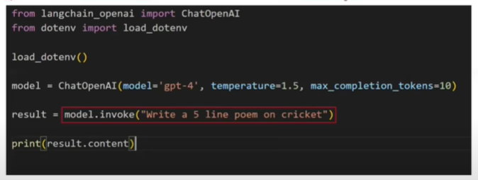
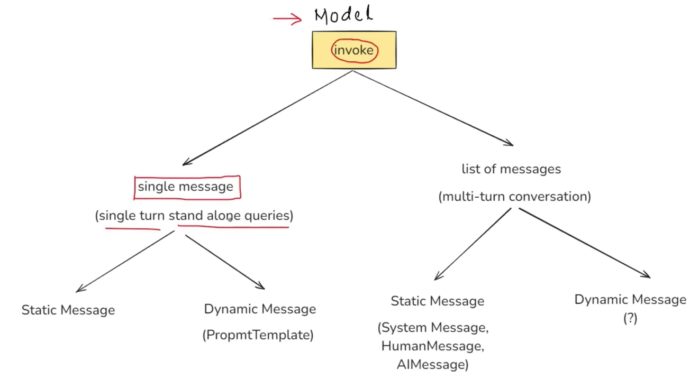

## Lession 04: Prompts 

### What are Prompts? 
- Prompts are the input instructions or queries given to a model to guide its output.



### Types of prompts:
- **Static Prompts:** 
    - In static prompt user directly give an input. Since, we know a slight change in prompt can change LLM output and LLM can halicunate as well. 
    - User can make a spelling mistake and LLM can misunderstand. 
    - User may not be to give proper prompt format and get a meaningful response. E.g., User is new. 
- **Dynamic Prompts:** 
    - In dynamic prompt, we create a template format to pass user input. 
    - This template helps to avoid dis-advantages of static prompts.  
    - Can be done to create dropdowns, and menu options. 
    - E.g. Template: 
        ```Please summarize the research paper titled "{paper_input}" with the following specifications:
        Explanation Style: {style_input}
        Explanation Length: {length_input}
        1. Mathematical Details: 
            - Include Relevant mathematical equations if present in the paper.
            - Explain the mathematical concepts using simple, intutive code snippets where applicable.
        2. Analogies:
            - Use relatable anologies to simplify complex ideas. 
        If certain information is not available in the paper, respond with: "Insufficient Information available" Instead of guessing.
        Ensure the summary is clear, accurate, and aligned with the provided style and length.
        ```

### Prompt Template
- A prompt template in Langchain is a structured way to create prompts dynamically by inserting variables into a pre-defined template. Instead of hardcoding prompts,
Prompt Template allows you to define placeholders that can be filled in at runtime with different inputs. 

- This makes it reusable, flexible and easy to manage, especially when working with dynamic user inputs or automated workflows.
- **Why use PromptTemplate over `f` strings?
    1. Default Validation: If any extra or missing variables is there than error will be generated. `validation = True` parameter can be setup. 
    2. Reusable: We can save the template as a json file. That can be loaded. 
    3. LangChain Ecosystem: Using of langchain chaning method can be used if we use PromptTemplate function of langchain. Therefore, we should use langchain ecosystem.

### Messages in Langchain 
- Generally, if we pass prompt directly from user without previous prompts. LLM will not consider previous prompts and may give standalone output. Therefore, all the previous prompts and result should be passed to help LLM understand and output accordingly. For e.g.,

```
You: Hi
AI: Hello! How can I assist you today?
You: Which one is greater 2 or 0.
AI: 2 is greater than 0. 
You: Now multiply the bigger number with 10.
AI: Let's say the bigger number is x.
Multiplying x by 10, we get: 

10x
```
- Therefore, we need to store chat history. After storing chat history. E.g,
```
You: Hi
AI: Hello! How can I assist you today?
You: Which one is greater 2 or 0.
AI: 2 is greater than 0. 
You: Now multiply the bigger number with 10.
AI: 2 multiplied by 10 is equal to 20.
You: Exit
```
- Now you storing the messages and you need to define the message type. There are three different types of messages: 
    - **System message:** System Message is usually passed in as the first of a sequence of input messages.
    - **Human message:** Message from a human. Messages that are passed in from a human to the model.
    - **AI message:** Message from an AI. All messages returned from a chat model as a response to a prompt.
- Refer code: [Code: Messages](4.Langchain_Prompts\messages.py)



- Now, we have learnt about static messages in Multi-message conversation. Let's learn about dynamic messages in Multi-message conversation.
- We do that using `ChatPromptTemplate` in langchain.
- Refer code: [Code: ChatPromptTemplate](#4.Langchain_Prompts\chat_prompt_template.py)

### Message Placeholder:
- A message placeholder in langchain is a special placeholder used inside a ChatPromptTemplate to dynamically insert chat history or a list of messages at runtime. 
- For e.g., If you made a chatbot in Amazon. Let's a user complaints about the order and requested for the refund. So, Refund is generated. Bot told it will be processed in 2-3 days. Now, user came after two days asking "where is my refund?".
- Now in the above sitation chatbot must save the messages to a server or database to be able to understand user query after 2 days. 
- Refer code: [Code: Message Placeholders](#4.Langchain_Prompts\message_placeholder.py)